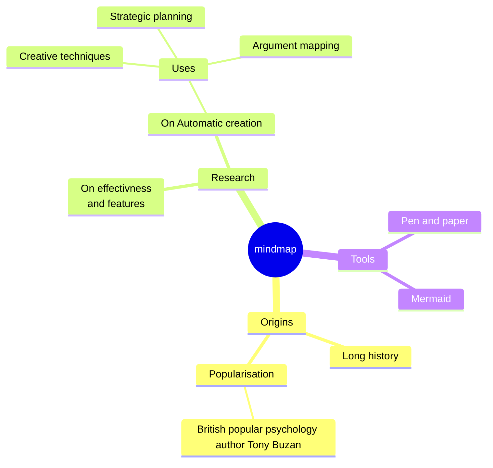
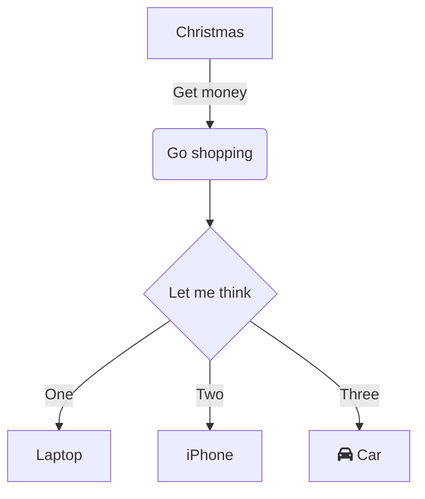

# Lesson 2 - Planning Your Written Work


![[Do Now]]

---

![[What will I have to do]]


---
# Planning your Written Work

* Planning Your Written Work / On the “Project Writing Assistance" page  [1 Year](https://study.cyberepq.org.uk/mod/scorm/view.php?id=41553)  [Extended](https://study.cyberepq.org.uk/mod/scorm/view.php?id=42101)
* Tools :
	* [https://mermaid\.live/](https://mermaid.live/)
		  * Mindmap
		  * Flow Chart
		  * Gantt
*  [UTCSheffield/CyberEPQ-Obsidian: CyberEPQ as taught at UTC Sheffield OLP with research and planning tools built in using Obsidian.](https://github.com/UTCSheffield/CyberEPQ-Obsidian) 
---

## Mindmap



---

```
mindmap
  root((mindmap))
    Origins
      Long history
      ::icon(fa fa-book)
      Popularisation
        British popular psychology author Tony Buzan
    Research
      On effectivness<br/>and features
      On Automatic creation
        Uses
            Creative techniques
            Strategic planning
            Argument mapping
    Tools
      Pen and paper
      Mermaid
```

---

## Flowchart



---

```
flowchart TD
    A[Christmas] -->|Get money| B(Go shopping)
    B --> C{Let me think}
    C -->|One| D[Laptop]
    C -->|Two| E[iPhone]
    C -->|Three| F[fa:fa-car Car]
```


---
## Get On With It

![[Upcoming Tasks]]
