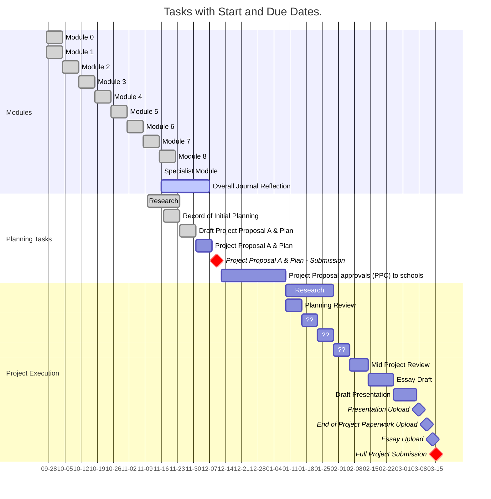

```mermaid
gantt  
title Tasks with Start and Due Dates.  
dateFormat YYYY-MM-DD  
axisFormat %m-%d  
tickInterval 1week

     
section Modules  
Module 0 :done, 2025-09-27,  7d  
Module 1 :done, 2025-09-27,  7d  
Module 2 :done,  7d  
Module 3 :done,  7d  
Module 4 :done,  7d  
Module 5 :done,  7d  
Module 6 :done,  7d  
Module 7 :done,  7d  
Module 8 :done,  7d  
Specialist Module :done, 2025-11-16  
Overall Journal Reflection :active, 21d  
section Planning Tasks  
Research :done, 2025-11-10,  14d  
Record of Initial Planning :done, 2025-11-17,  7d  
Draft Project Proposal A & Plan :done,  7d  
Project Proposal A & Plan : 7d  
Project Proposal A & Plan - Submission :crit, milestone, 2025-12-12  
Project Proposal approvals (PPC) to schools :2026-01-09  
section Project Execution  
Research : 3w  
Planning Review :2026-01-09, 2026-01-16  
?? : 7d  
?? : 7d  
?? : 7d  
Mid Project Review :2026-02-14  
Essay Draft :2026-02-25  
Draft Presentation :2026-03-07  
Presentation Upload :milestone, 2026-03-09  
End of Project Paperwork Upload :milestone, 2026-03-14  
Essay Upload :milestone, 2026-03-14  
Full Project Submission :crit, milestone, 2026-03-17
```
