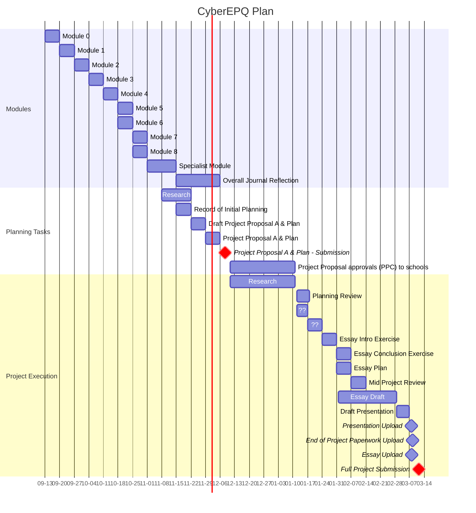

```mermaid
gantt  
title CyberEPQ Plan  
dateFormat YYYY-MM-DD  
axisFormat %m-%d  
tickInterval 1week

     
section Modules  
Module 0 :2026-09-13,  7d  
Module 1 :2026-09-20,  7d  
Module 2 : 7d  
Module 3 : 7d  
Module 4 : 7d  
Module 5 : 7d  
Module 6 :2026-10-18,  7d  
Module 7 :2026-10-25,  7d  
Module 8 :2026-10-25,  7d  
Specialist Module :2026-11-15  
Overall Journal Reflection : 21d  
section Planning Tasks  
Research :2026-11-08,  14d  
Record of Initial Planning :2026-11-15,  7d  
Draft Project Proposal A & Plan : 7d  
Project Proposal A & Plan : 7d  
Project Proposal A & Plan - Submission :crit, milestone, 2026-12-11  
Project Proposal approvals (PPC) to schools :2027-01-11  
section Project Execution  
Research :2026-12-11, 2027-01-11  
Planning Review :2027-01-12, 2027-01-18  
?? :2027-01-12,  5d  
?? : 7d  
Essay Intro Exercise : 7d  
Essay Conclusion Exercise : 7d  
Essay Plan :2027-01-31,  7d  
Mid Project Review :2027-02-14  
Essay Draft :2027-02-01,  4w  
Draft Presentation :2027-03-07  
Presentation Upload :milestone, 2027-03-09  
End of Project Paperwork Upload :milestone, 2027-03-08  
Essay Upload :milestone, 2027-03-08  
Full Project Submission :crit, milestone, 2027-03-15
```
