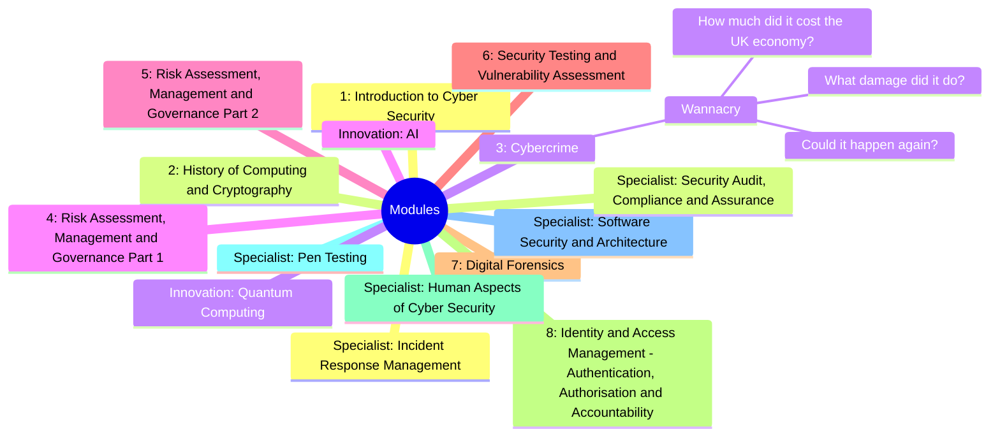

```mermaid
mindmap
    root((Modules))

        1: Introduction to Cyber Security

        2: History of Computing and Cryptography

        3: Cybercrime

            Wannacry

                What damage did it do?

                Could it happen again?

                How much did it cost the UK economy?

        4: Risk Assessment, Management and Governance Part 1

        5: Risk Assessment, Management and Governance Part 2

        6: Security Testing and Vulnerability Assessment

        7: Digital Forensics

        8: Identity and Access Management - Authentication, Authorisation and Accountability

        Specialist: Human Aspects of Cyber Security

        Specialist: Pen Testing

        Specialist: Software Security and Architecture

        Specialist: Incident Response Management

        Specialist: Security Audit, Compliance and Assurance

        Innovation: Quantum Computing

        Innovation: AI
        
```

