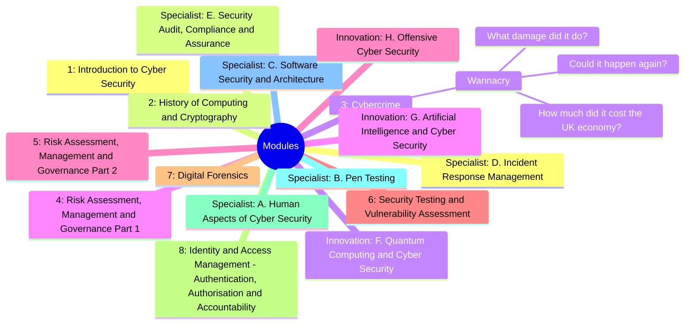

```mermaid
mindmap
    root((Modules))
        1: Introduction to Cyber Security
        2: History of Computing and Cryptography
        3: Cybercrime
            Wannacry
                What damage did it do?
                Could it happen again?
                How much did it cost the UK economy?
        4: Risk Assessment, Management and Governance Part 1
        5: Risk Assessment, Management and Governance Part 2
        6: Security Testing and Vulnerability Assessment
        7: Digital Forensics
        8: Identity and Access Management - Authentication, Authorisation and Accountability
        Specialist: A. Human Aspects of Cyber Security
        Specialist: B. Pen Testing
        Specialist: C. Software Security and Architecture
        Specialist: D. Incident Response Management
        Specialist: E. Security Audit, Compliance and Assurance
        Innovation: F. Quantum Computing and Cyber Security
        Innovation: G. Artificial Intelligence and Cyber Security
        Innovation: H. Offensive Cyber Security
        
```

